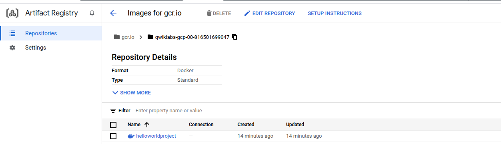
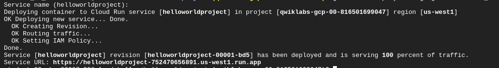
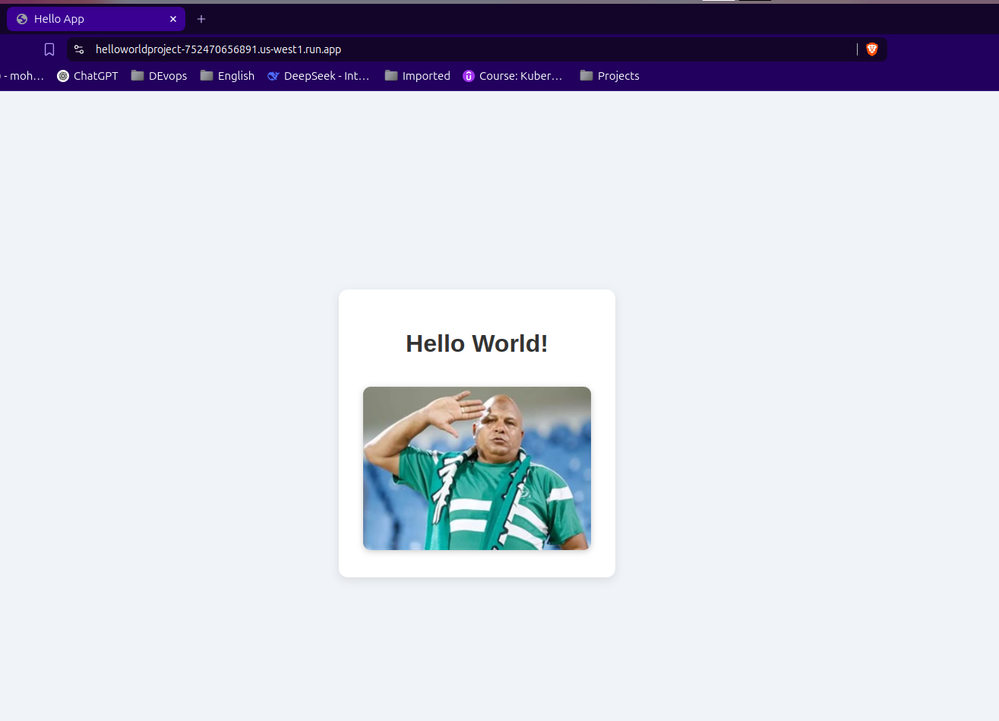
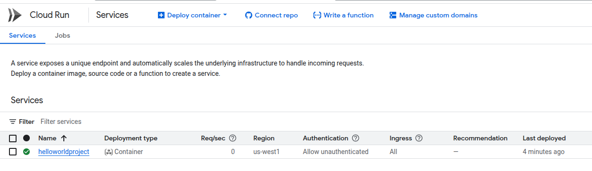

# **Hello World App on Google Cloud Run** 

A simple **Node.js + Express** web app with a frontend UI, containerized with **Docker**, and deployed to **Google Cloud Run**.
---

##  Project Structure

```plaintext
helloworldproject/
├── Dockerfile                 # Dockerfile for containerization 
├── package.json               # Project dependencies and scripts 
├── server.js                  # Express server setup 
├── public/                    # Frontend files 
│   ├── index.html             # HTML structure 
│   ├── style.css              # Styles for the frontend 
│   └── adel-shakl.jpg         # Image of Adel Shakl 
├── images/                    # Screenshots for documentation 
│   ├── img1.png               # Build screenshot 
│   ├── img2.png               # Cloud Run deploy screenshot 
│   ├── img3.png               # Web app running screenshot
│   └── img4.png               # Cloud Run dashboard screenshot 
```

---

##  Setup Instructions

### 1. Enable the Cloud Run API and Configure Your Shell Environment

- **Enable Cloud Run API**:

```bash
gcloud services enable run.googleapis.com
```

- **Set the compute region for your project**:

```bash
gcloud config set compute/region us-central1
```

- **Create a LOCATION environment variable**:

```bash
LOCATION="us-central1"
```

---

### 2. Write the Sample Application from Your Cloud Shell

Create the project directory and set up the frontend and backend:

```bash
mkdir helloworldproject && cd helloworldproject
mkdir public && cd public
```

Create the `index.html` page:

```html
<!DOCTYPE html>
<html lang="en">
------
</html>
```

Create the `style.css` file:

```css
body {
---------
------
}
```

Back to the project directory, create `server.js`:

```javascript
const express = require('express');
-------------
});
```

Create `package.json`:

```json
{
  "name": "helloworld",
  -------------
  
}
```

---

### 3. Containerize Your App and Upload It to Artifact Registry

Create a `Dockerfile` with the following content:

```Dockerfile
FROM node:18-slim
WORKDIR /usr/src/app

COPY package*.json ./

RUN npm install --only=production

COPY . .

EXPOSE 8080

CMD ["npm", "start"]
```

Now, build your container image using **Cloud Build**:

```bash
gcloud builds submit --tag gcr.io/$GOOGLE_CLOUD_PROJECT/helloworldproject
```

**Cloud Build** will execute the build steps in a Docker container and push your app to **Artifact Registry**.

---

### 4. Deploy to Cloud Run

Deploy your containerized app to **Cloud Run**:

```bash
gcloud run deploy --image gcr.io/$GOOGLE_CLOUD_PROJECT/helloworldproject --allow-unauthenticated --region=$LOCATION
```

When prompted, confirm the service name by pressing **Enter**. After the deployment, you'll receive a URL for your app.

---

### 5. Clean Up

To avoid unnecessary charges, you can delete the container image and Cloud Run service:

- **Delete the container image**:

```bash
gcloud container images delete gcr.io/$GOOGLE_CLOUD_PROJECT/helloworldproject
```

- **Delete the Cloud Run service**:

```bash
gcloud run services delete helloworld --region=us-west1
```

---

##  Screenshots

| Step                          | Screenshot                |
|------------------------------|---------------------------|
| **Build with Cloud Build**    |  |
| **Cloud Run Deploy**          | |
| **Web App Running**           | |
| **Cloud Run Dashboard**       | |

---

## 👨‍💻 Author

**Mohamed Mourad**  

